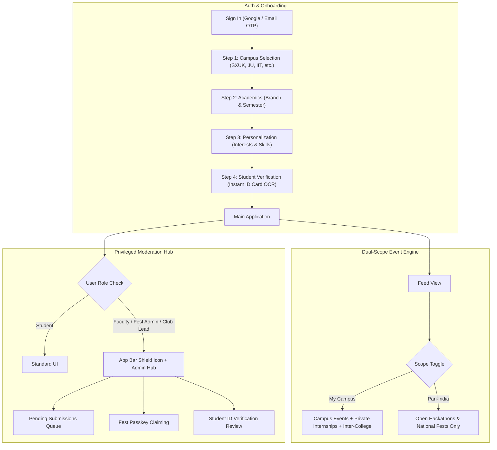

# Pan-India Multi-College Architecture, Onboarding, Tutorial Guide & Admin Moderation Hub

## Goal Description
Expand CampusSignal from a single-institution app (SXUK) to a **federated, Pan-India multi-college discovery network** across universities in India. 

This plan addresses:
1. **Multi-College Scoping & Host Branding**: Students across universities (e.g., JU, IITs, DU, SXUK) clearly see which institution is hosting each event. Hackathons and major fests are federated pan-India (`interCollege`), while local notices and events remain campus-only (`intraCollege`).
2. **Private Internship Wall**: Internships, placement drives, and company visits are strictly walled to the student's own college (`intraCollege` only, enforced by Supabase Row-Level Security).
3. **Verification without `.edu` Emails**: Accommodates the Indian university reality where `.edu` emails are rare, providing tiered verification (Google OAuth / personal email + Student ID Card photo OCR).
4. **Modern, Intuitive Multi-Step Onboarding**: A 4-step Material 3 Expressive setup wizard with visual college selection, dynamic department/semester selection, interest/skill personalization, and optional student verification.
5. **Interactive Tutorial & Guide System**: A role-aware tutorial screen accessible anytime to students, club organizers, and admins explaining platform rules, filters, verification perks, and publishing workflows.
6. **Unified Admin Moderation Hub**: A mobile-first moderation console for **Campus Admins/Faculty** AND **Fest/Hackathon Convenors**, enabling triage (Approve/Reject/Edit/Promote to Inter-College) and passkey-based fest management.

---

## User Review Required

> [!IMPORTANT]
> **Internship Privacy Rule**: Any event marked with category `Internship` or `Placement` will have its scope permanently locked to `intraCollege`. It will physically never be queryable or visible to users outside the hosting college.

> [!IMPORTANT]
> **Fest & Hackathon Convenor Passkeys**: To allow student fest heads (e.g. *XavHacks 2026 Core Team* or *JU Srijan Committee*) to approve sub-events and hackathon tracks without needing faculty intervention, we introduce 6-character alphanumeric passkeys (e.g. `XAVHACKS-26`). Entering this key elevates their session to **Fest Admin** for that specific fest.

> [!WARNING]
> **Backward Compatibility with Existing Data**: Existing events in the local mock catalog and Supabase that lack `college_id` will default to `SXUK` (`St. Xavier's University, Kolkata`) to preserve existing testing stability.

---

## Architecture & Data Flow



---

## Proposed Changes

Grouped by component layer:

### 1. Data Models & Constants (`lib/models/`, `lib/core/constants/`)

#### [NEW] `lib/models/college_model.dart`
Defines the `CollegeModel` entity for multi-college indexing:
```dart
class CollegeModel {
  final String id;
  final String name;
  final String shortCode; // e.g. "SXUK", "JU", "IITKGP"
  final String city;
  final String state;
  final String? logoUrl;
  final List<String> domainPatterns; // e.g. ["@sxuk.edu.in", "@sxuk.in"]
  final List<String> popularBranches;

  const CollegeModel({
    required this.id,
    required this.name,
    required this.shortCode,
    required this.city,
    required this.state,
    this.logoUrl,
    this.domainPatterns = const [],
    this.popularBranches = const [],
  });
  // fromJson, toJson, copyWith, equality
}
```

#### [MODIFY] `lib/models/event_model.dart`
- Add `EventScope` enum (`intraCollege`, `interCollege`).
- Add `EventModerationStatus` enum (`draft`, `pendingApproval`, `published`, `rejected`).
- Add fields:
  - `String? collegeId`
  - `String? collegeName`
  - `String? collegeShortCode`
  - `String? collegeLogoUrl`
  - `EventScope scope` (default `EventScope.intraCollege`)
  - `EventModerationStatus moderationStatus` (default `EventModerationStatus.published`)
  - `String? festId` (grouping sub-events under a master fest/hackathon)
  - `String? festName`
  - `String? approvedBy`
  - `String? rejectionReason`
- Update JSON serialization & deserialization with defensive fallbacks.

#### [MODIFY] `lib/models/profile_model.dart`
- Add `UserRole` enum (`student`, `clubLead`, `festAdmin`, `faculty`, `superAdmin`).
- Add fields:
  - `String? collegeId`
  - `String? collegeName`
  - `String? collegeShortCode`
  - `UserRole role` (default `UserRole.student`)
  - `bool isVerifiedStudent` (default `false`)
  - `String? rollNumber`
  - `List<String> managedFestIds` (fest IDs this user has moderation authority over)
  - `List<String> managedClubIds`
- Add helper getters:
  - `bool get canModerate => role != UserRole.student || managedFestIds.isNotEmpty;`
  - `bool get canPublishDirectly => role == UserRole.faculty || role == UserRole.clubLead || role == UserRole.festAdmin || role == UserRole.superAdmin;`

#### [MODIFY] `lib/core/constants/app_constants.dart`
- Provide a curated master directory of popular Indian universities (SXUK, Jadavpur University, IIT Bombay, IIT Kharagpur, DU, St. Xavier's Mumbai, Christ University, etc.).
- Add role definitions and default inter-college categories: `{'hackathon', 'fest', 'competition', 'conference'}`.

---

### 2. Modern 4-Step Onboarding Wizard (`lib/features/onboarding/`)

#### [MODIFY] `lib/features/onboarding/onboarding_controller.dart`
- Extend state with:
  - `selectedCollegeId`, `selectedCollegeName`, `selectedCollegeShortCode`.
  - `step`: 0 (College Selection), 1 (Academic Details), 2 (Interests & Skills), 3 (Student Verification).
  - `idCardImageFile`, `isVerifyingIdCard`, `verificationSuccess`.
- Add actions:
  - `selectCollege(CollegeModel college)`
  - `verifyIdCard(XFile imageFile)`: calls [`gemini_ocr_service.dart`](file:///D:/CampusSignal/lib/core/services/gemini_ocr_service.dart) to detect college name, roll number, and student name.
  - `skipVerification()`: allows instant entry as an unverified student.

#### [MODIFY] `lib/features/onboarding/onboarding_screen.dart`
Redesign into an expressive Material 3 page-view wizard:
1. **Step 1 - Find Your Campus**:
   - Modern search field with autocomplete.
   - Quick-select pills for prominent universities (SXUK, JU, IIT, etc.).
   - Visual card preview of selected campus with city & badge.
2. **Step 2 - Academic Background**:
   - Dynamic branch dropdown (pre-filled with selected college's programs).
   - Degree level selector, year, and semester chips.
3. **Step 3 - Signal Radar (Interests & Skills)**:
   - Interactive, animated M3 filter chip grid for interests and technical/creative skills.
4. **Step 4 - Campus Verification Fast-Track**:
   - Highlighting verified benefits: *"Private Campus Internships & Placement Notices"*, *"Official Club Voting"*, *"Verified Student Badge"*.
   - Camera/Gallery button for Student ID Card with instant OCR feedback, or a prominent "Continue for Now (Verify Later)" button.

---

### 3. Interactive Tutorial & Guidance System (`lib/features/tutorial/`)

#### [NEW] `lib/features/tutorial/tutorial_screen.dart`
A dedicated, high-polish visual guide with tabbed guidance:
- **Tab 1: Student Guide**:
  - Understanding **"My Campus" vs "Pan-India"** feed scopes.
  - Discovering inter-college hackathons and prizes.
  - How the **Private Internship Wall** keeps sensitive placement drives secure.
  - Syncing deadlines to Google Calendar / local alarms.
- **Tab 2: Club & Fest Organizers Guide**:
  - How to create announcements using the AI Poster Extractor ([`gemini_ocr_service.dart`](file:///D:/CampusSignal/lib/core/services/gemini_ocr_service.dart)).
  - When to choose **"Campus Only"** vs **"Pan-India Inter-College"**.
  - Adding coordinator contact cards and WhatsApp/Instagram handles.
- **Tab 3: Admins & Convenors Guide**:
  - How the **Moderation Queue** functions.
  - Approving sub-events, editing scopes, or providing actionable rejection feedback.
  - How Fest Passkeys allow delegating approval authority to the student organizing team.

#### [MODIFY] `lib/features/profile/profile_screen.dart` & `lib/features/settings/settings_screen.dart`
- Add an **"App Guide & Tutorial"** menu tile with an illustration badge so users and admins can revisit the tutorial at any point.

---

### 4. Unified Admin Moderation Hub (`lib/features/admin/`)

#### [NEW] `lib/features/admin/admin_moderation_screen.dart`
A contextual management console for authorized users:
- **Header Summary Card**:
  - Displays user role badge (e.g. `[🏛️ Faculty Coordinator - SXUK]` or `[⚡ Fest Convenor - XavHacks 2026]`).
  - Active pending counter and quick filter chips.
- **Tab 1: Submission Triage (Pending Approvals)**:
  - Rich cards showing event poster, title, category, host club/student, and requested scope.
  - Quick action buttons:
    - **Approve**: Publishes event instantly.
    - **Elevate to Inter-College**: One-tap toggle to broadcast a high-quality hackathon pan-India.
    - **Reject with Reason**: Modal bottom sheet with predefined rejection reasons or custom note.
- **Tab 2: Fest Convenor Key Redemption**:
  - Allows student organizers to enter a passkey (e.g. `XAVHACKS-2026`) to unlock moderation permissions for their fest.
- **Tab 3: ID Verification Queue (Faculty/Admin only)**:
  - View flagged student ID card submissions that require manual sign-off.

#### [NEW] `lib/features/admin/admin_controller.dart`
State management for the moderation queue, passkey redemption, and approval operations.

#### [MODIFY] `lib/features/feed/feed_screen.dart`
- **App Bar**: Add a conditional `AdminShield` icon if `profile.canModerate == true` showing a badge with the pending count.
- **Scope Toggle Bar**: Add a segmented switch:
  - **"My Campus"** (Selected college local events + private internships + pan-India hackathons)
  - **"Pan-India"** (Only open inter-college hackathons and national fests across India).

#### [MODIFY] `lib/core/widgets/m3e_event_card.dart`
- Display host college banner on cards:
  - If `scope == EventScope.interCollege`: Display `[🏛️ SXUK • Inter-College]`.
  - If `category == 'internship'`: Display `[🔒 Campus Only • SXUK]`.

---

### 5. Routing Configuration (`lib/app/router.dart`)

#### [MODIFY] `lib/app/router.dart`
- Register `/tutorial` (`TutorialScreen`).
- Register `/admin-moderation` (`AdminModerationScreen`).

---

## Verification Plan

### Automated Tests
1. **Model & Serialization Tests**:
   - Test `CollegeModel` serialization, equality, and branch lookups.
   - Test `EventModel` with `EventScope`, `EventModerationStatus`, and college metadata.
   - Test `ProfileModel` with roles (`student`, `festAdmin`, `faculty`), verification status, and `canModerate` getters.
   - Verify existing mock data compatibility.
   ```powershell
   flutter test test/models_and_repositories_test.dart
   ```
2. **Scoping & Filtering Logic Tests**:
   - Verify that internships are excluded when querying from a different college.
   - Verify that `interCollege` hackathons are visible across colleges.
   ```powershell
   flutter test test/event_details_and_caching_test.dart
   ```
3. **Full Suite Execution**:
   ```powershell
   flutter test
   ```

### Manual Verification
1. **Onboarding Flow**:
   - Launch app → Navigate to `/onboarding`.
   - Step 1: Select "Jadavpur University (JU)" or "St. Xavier's University, Kolkata (SXUK)".
   - Step 2: Choose branch and semester.
   - Step 3: Pick interests & skills.
   - Step 4: Verify student ID OCR flow or choose "Verify Later".
   - Confirm profile successfully reflects selected college.
2. **Feed Scoping & Badges**:
   - In Feed, verify event cards show the host college badge (`[🏛️ SXUK • Inter-College]`).
   - Switch scope toggle to "Pan-India" → Verify only inter-college hackathons/fests appear.
   - Switch scope toggle to "My Campus" → Verify local events and internships appear.
3. **Tutorial Screen**:
   - Open Profile → Tap "App Guide & Tutorial".
   - Switch between "Student Guide", "Organizers Guide", and "Admins & Convenors Guide".
4. **Admin Moderation Hub**:
   - Elevate profile to `festAdmin` or enter passkey `DEMO-FEST-2026`.
   - Verify the Admin Shield icon appears in the feed app bar.
   - Open `/admin-moderation` → Test approving and rejecting pending events.
